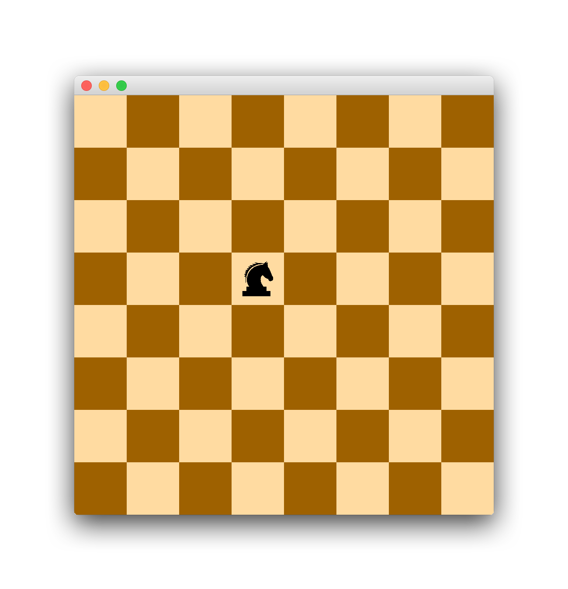

# What is the Knights Tour?

Traditionally the "Knight's Tour" is a sequence of moves done by a knight on a chessboard. The knight is placed on an empty chessboard and, following the rules of chess, must visit each square exactly once.

A "closed" tour is described by a tour that finishes with the knight on a square that is just one move away from the square on which it started.

# My Solution

The algorithm I used to solve the knights tour problem uses an accessibility matrix. The accessibility matrix keeps track of how many moves can be made from a position. The knight aways looks for the least accessible position to move onto next. This way, it will go through all the hardest spots first. This does not complete a closed tour.

### How to use it
> 1. Click on a square to place the knight.
> 2. Click again to start the tour.
> 3. Click once more to reset to reset.

